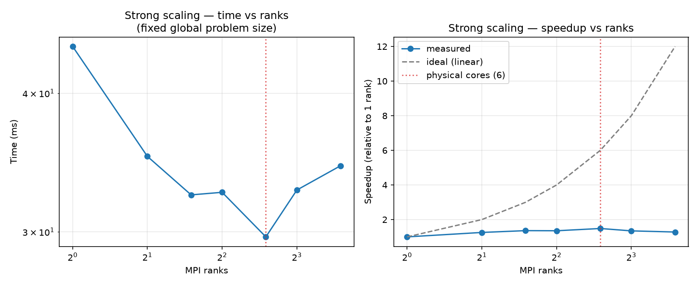
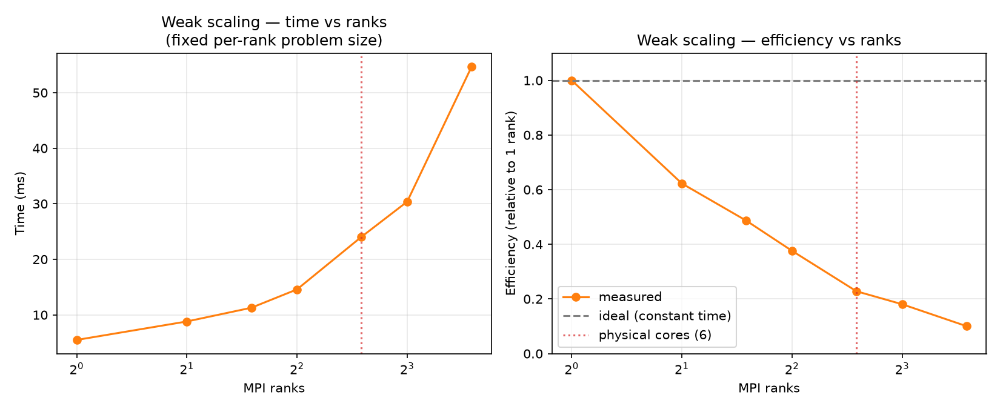

# line1

A production-quality implementation of **BLAS Level 1** (vector-vector operations) in C, built from scratch across seven phases: serial implementation, correctness testing, benchmarking, SIMD kernels, and an MPI-parallel layer.

BLAS (Basic Linear Algebra Subprograms) is the specification underneath nearly every scientific computing library — NumPy, MATLAB, and PyTorch all eventually call into a BLAS implementation. Level 1 covers the simplest building block: operations on 1D vectors, no matrices yet. This project implements all six standard Level 1 operations, correctly and with real attention to the numerical and performance details that separate a working implementation from a *careful* one — then parallelizes them with MPI and measures exactly how, and how far, that parallelism actually helps.

## The six operations

| Function | What it computes | Math |
|---|---|---|
| `dot` | Dot product of two vectors | `Σ xᵢ·yᵢ` |
| `axpy` | Scale + add | `y ← αx + y` |
| `scal` | Scale a vector in place | `x ← αx` |
| `nrm2` | Euclidean norm | `√(Σ xᵢ²)` |
| `asum` | Sum of absolute values | `Σ |xᵢ|` |
| `iamax` | Index of the largest-magnitude element | `argmax |xᵢ|` |

Every function supports non-unit strides (`incx`/`incy`), matching the real BLAS calling convention where vector elements aren't always contiguous in memory. **The sign convention differs by function, matching reference BLAS exactly rather than a single library-wide rule:**
- `dot` and `axpy` support **negative** strides — a negative `incx`/`incy` walks backward through the same memory span the pointer already points at the start of (no caller-side pointer offset needed), matching reference BLAS's `DDOT`/`DAXPY`.
- `scal`, `nrm2`, `asum`, and `iamax` do **not** support negative (or zero) strides, matching reference BLAS's `DSCAL`/`DNRM2`/`DASUM`/`IDAMAX` exactly: `incx <= 0` returns a zero/no-op result immediately rather than reading or writing out of bounds.

`incx == 0`/`incy == 0` is caller error for `dot`/`axpy` (undefined — real BLAS doesn't define it either) and is explicitly guarded to a zero/no-op result for the other four.

## Requirements

- CMake 3.18+
- A C11 compiler (developed and tested with GCC; C11 is enforced strictly — `-std=c11`, not `-std=gnu11`)
- **Optional**, for the MPI layer: an MPI implementation (OpenMPI or MPICH)
- **Optional**, for the scaling plots: Python 3 + matplotlib (`pip install matplotlib` or your distro's package)

## Building

Quick start (serial library + test suite):

```bash
cmake -B build -DCMAKE_BUILD_TYPE=Release
cmake --build build --parallel
ctest --test-dir build
```

### Build options

| Option | Default | Description |
|---|---|---|
| `LINE1_BUILD_TESTS` | `ON` | Build the correctness test suite |
| `LINE1_BUILD_BENCH` | `OFF` | Build the benchmark suite (`bench_dot`, `bench_axpy`, and the MPI scaling benchmark) |
| `LINE1_BUILD_MPI` | `OFF` | Build the MPI parallel layer, its tests, and its benchmark |
| `LINE1_USE_FLOAT` | `OFF` | Build in single precision (`float`) instead of `double` |
| `LINE1_STRICT_IEEE` | `ON` | Strict IEEE 754 compliance — no `-ffast-math`. **Default**, deliberately: this library's pitch is careful, numerically robust arithmetic (Kahan-compensated summation, overflow/underflow-safe `nrm2`, explicit `Inf`/`NaN` handling), and `-ffast-math` actively undermines that — confirmed directly (by inspecting generated assembly, not just documented) to eliminate this library's own `Inf`/`NaN`-handling branches and to reduce `blas_dot_kahan()` to bit-identical output with plain `blas_dot()`, silently making the Kahan variant do nothing useful. Set to `OFF` to opt in to `-ffast-math` for maximum throughput once you've decided that trade-off is worth it for your use case — see "Numerical robustness vs. raw throughput" below |
| `LINE1_BUILD_SHARED` | `OFF` | Also build `libline1.so` (properly versioned, `libline1.so.1.0.0` with `.so.1`/`.so` symlinks) alongside the always-built static `libline1.a` |

With the MPI layer and benchmarks both enabled:

```bash
cmake -B build -DCMAKE_BUILD_TYPE=Release -DLINE1_BUILD_MPI=ON -DLINE1_BUILD_BENCH=ON
cmake --build build --parallel
ctest --test-dir build          # runs serial + MPI tests + benchmark smoke tests
```

Architecture-specific SIMD kernels (AVX2 on x86, NEON on ARM) are detected and selected automatically at configure time — no flag needed. If neither is available, a portable scalar fallback is used, and this is reported in the configure output either way.

### Numerical robustness vs. raw throughput

The **default** build (`LINE1_STRICT_IEEE=ON`) is strict IEEE 754: no `-ffast-math`. This is a deliberate choice, not an oversight — this library's whole pitch is careful, numerically robust arithmetic, and `-ffast-math` actively works against that:

- `-ffast-math` implies `-ffinite-math-only`, which entitles the compiler to assume no floating-point value is ever `Inf` or `NaN`. Confirmed directly by inspecting the generated assembly (not just documented as a theoretical risk): under this flag, GCC dead-code-eliminates the `Inf`-handling guards `nrm2()` and `asum()` depend on to return a correct `+Inf` (instead of a spurious `NaN`) for input containing infinities.
- `-ffast-math` permits floating-point reassociation, which is confirmed to reduce `blas_dot_kahan()` on this project's own Release flags to bit-identical output with the uncompensated `blas_dot()` — silently making the "Kahan" variant pay for extra arithmetic while providing none of its accuracy benefit.

Set `-DLINE1_STRICT_IEEE=OFF` to opt in to `-ffast-math` for maximum throughput, once you've specifically decided that trade-off is worth it — this matches what OpenBLAS and MKL do by default, but here it's an explicit choice rather than a silent one. Benchmarks (`bench/`) always build with `-ffast-math` regardless of this setting, since raw best-case throughput is exactly what a benchmark should report; this option only affects the library callers actually link against.

### A note on portability: `-march=native`

Release builds (with either `LINE1_STRICT_IEEE` setting) use `-march=native` by default, which tunes code generation for the exact CPU the library is *compiled* on — using AVX2/FMA/NEON instructions if that machine has them. **A `-march=native` build is not portable**: the resulting binary can crash with `SIGILL` (illegal instruction) if copied to and run on a different, older, or otherwise less-capable CPU than the one it was built on. This is fine (and standard practice) for building and running on the same machine, or in a container image that will only ever run on matching hardware. If you're building a binary or shared library that will be distributed to or run on machines you don't control, override the architecture flag yourself (e.g. `-march=x86-64-v2` for a broad-but-still-modern x86_64 baseline, or drop `-march` entirely) rather than relying on the default.

## Installing

```bash
cmake -B build -DCMAKE_BUILD_TYPE=Release -DLINE1_BUILD_MPI=ON
cmake --build build --parallel
cmake --install build --prefix /your/install/path   # defaults to /usr/local
```

This installs the static library, public headers, and a [pkg-config](https://en.wikipedia.org/wiki/Pkg-config) file, so other projects can find and link this library with:

```bash
gcc myprogram.c $(pkg-config --cflags --libs line1) -o myprogram
```

If built with `-DLINE1_BUILD_MPI=ON`, a second file, `line1-mpi`, covers the MPI layer separately (`Requires: line1`, so its own flags chain in `line1`'s automatically):

```bash
mpicc myprogram.c $(pkg-config --cflags --libs line1-mpi) -o myprogram
```

`make install` is a shorthand for the same thing.

## Testing

```bash
ctest --test-dir build            # everything
ctest --test-dir build -R mpi_    # just the MPI tests
make test                         # equivalent, via the convenience Makefile
```

Testing philosophy: floating-point results are never compared with `==`. Every test checks that the absolute or relative error is below an explicit tolerance, with known-answer cases, edge cases (empty vectors, single-element vectors, non-unit strides), and cross-checks against reference implementations computed independently.

## Benchmarks

### Serial

Measured with `bench_dot`/`bench_axpy` (100 trials per size, median reported; full output in `results/`), on the AVX2 backend (`cmake -B build -DCMAKE_BUILD_TYPE=Release -DLINE1_BUILD_BENCH=ON`, default `LINE1_STRICT_IEEE=ON` — the AVX2 kernels use explicit intrinsics rather than auto-vectorization, so they don't depend on `-ffast-math` for their throughput). `dot` is 2 FLOPs and 16 bytes per element; `axpy` is 2 FLOPs and 24 bytes:

*(Re-measured after fixing a `cmake/DetectArch.cmake` bug that had silently forced every build, including the numbers previously shown here, onto the generic scalar fallback instead of AVX2 — see git history. The small-`n` GFlop/s jump below versus that earlier table is that fix taking effect.)*

| n | dot warm GB/s | dot warm GFlop/s | axpy warm GB/s | axpy warm GFlop/s |
|---:|---:|---:|---:|---:|
| 1,000 | 95.8 | 11.98 | 176.5 | 14.71 |
| 16,000 | 85.4 | 10.67 | 100.5 | 8.37 |
| 1,000,000 | 28.7 | 3.59 | 47.6 | 3.97 |
| 16,000,000 | 23.1 | 2.89 | 28.9 | 2.41 |
| 100,000,000 | 22.0 | 2.76 | 27.1 | 2.26 |

**Key insight, and the reason the numbers plateau instead of climbing:** BLAS Level 1 is almost always memory-bandwidth-limited, not compute-limited. There's very little arithmetic per element — the bottleneck is how fast data can move from DRAM, not how fast the CPU can multiply. This single fact shapes most of the design decisions in this library (the SIMD kernels, for instance, help most at small-to-medium sizes still resident in cache; at large `n`, moving to AVX2 barely matters because the memory bus, not the ALU, is already the limit).

### MPI scaling

Measured with `bench_mpi_dot` across MPI rank counts 1–12 on a 6-core/12-thread CPU, both strong scaling (fixed global problem size, more ranks sharing the same work) and weak scaling (fixed per-rank size, so the global problem grows with rank count):




| ranks | strong: time (ms) | strong: speedup | weak: time (ms) | weak: efficiency |
|---:|---:|---:|---:|---:|
| 1 | 44.1 | 1.00× | 5.5 | 1.00 |
| 2 | 35.1 | 1.26× | 8.8 | 0.62 |
| 3 | 32.4 | 1.36× | 11.3 | 0.49 |
| 4 | 32.6 | 1.35× | 14.6 | 0.38 |
| 6 | 29.7 | **1.48×** | 24.0 | 0.23 |
| 8 | 32.7 | 1.35× | 30.4 | 0.18 |
| 12 | 34.4 | 1.28× | 54.7 | 0.10 |

(raw data: `bench/mpi/results/scaling_results.csv`)

**This is the same memory-bandwidth story, now at the MPI layer.** `dot`'s local computation is essentially pure memory traffic with almost no arithmetic to hide it behind, so once a handful of ranks are pulling data from DRAM simultaneously, the memory bus — not the number of ranks — is the bottleneck. Strong-scaling speedup peaks at 6 ranks (~1.48×) and never approaches linear; weak-scaling efficiency falls to ~10% by 12 ranks. Both are the expected signature of a memory-bandwidth-bound kernel on a CPU with a small number of memory channels relative to its core count, not a flaw in the MPI implementation — `blas_mpi_dot`'s correctness was verified independently (see `tests/mpi/`) before any of this scaling data was gathered.

**A real gotcha worth documenting**, since it silently produced wrong data before being caught: OpenMPI's default rank-to-core mapping packs both SMT/hyperthread siblings of a core before moving to the next core, rather than spreading ranks across distinct physical cores first. On a 6-core/12-thread CPU, an unqualified 8-rank run can end up using only 4 of the 6 physical cores while 2 sit idle — with no error or warning. Verified by hand with `mpirun --report-bindings`; the fix is `--map-by core --bind-to hwthread` alongside `--use-hwthread-cpus`, which forces breadth-first placement across distinct cores before ever doubling up on SMT threads. See `bench/mpi/run_scaling.sh` for the full explanation and the exact flags used.

Reproduce with:
```bash
cmake -B build -DLINE1_BUILD_MPI=ON -DLINE1_BUILD_BENCH=ON -DCMAKE_BUILD_TYPE=Release
cmake --build build --parallel
bash bench/mpi/run_scaling.sh          # edit RANK_COUNTS to match your core count first
python3 bench/mpi/plot_scaling.py
```

## API reference

### Serial (`include/line1/*.h`)

| Function | Signature | Notes |
|---|---|---|
| `blas_dot` | `BLAS_REAL blas_dot(blas_int n, const BLAS_REAL *x, blas_int incx, const BLAS_REAL *y, blas_int incy)` | Supports negative strides (see stride note above) |
| `blas_dot_kahan` | same signature as `blas_dot` | Kahan-compensated summation, for callers who need reduced rounding error at some extra cost |
| `blas_axpy` | `void blas_axpy(blas_int n, BLAS_REAL alpha, const BLAS_REAL *x, blas_int incx, BLAS_REAL *y, blas_int incy)` | `alpha == 0` is a fast no-op path |
| `blas_scal` | `void blas_scal(blas_int n, BLAS_REAL alpha, BLAS_REAL *x, blas_int incx)` | `alpha == 0` explicitly zeroes (never multiplies), avoiding NaN propagation. `incx <= 0` is a no-op (see stride note above) |
| `blas_nrm2` | `BLAS_REAL blas_nrm2(blas_int n, const BLAS_REAL *x, blas_int incx)` | Scaled two-pass algorithm (Blue 1978 / LAPACK `dnrm2`) — avoids overflow/underflow that a naive `sqrt(sum(x[i]*x[i]))` would hit on extreme-magnitude input. Returns `+Inf` (not `NaN`) for a vector containing `Inf`; returns `0.0` for `incx <= 0` |
| `blas_asum` | `BLAS_REAL blas_asum(blas_int n, const BLAS_REAL *x, blas_int incx)` | Returns `0.0` for `incx <= 0` (see stride note above) |
| `blas_iamax` | `blas_int blas_iamax(blas_int n, const BLAS_REAL *x, blas_int incx)` | 1-based index (BLAS/Fortran convention); returns `0` for `n <= 0` or `incx <= 0` |

`BLAS_REAL` is `double` by default, `float` if built with `-DLINE1_USE_FLOAT=ON`. `blas_int` is `int64_t`, to support vectors past 2 billion elements.

### MPI (`include/line1/mpi/*.h`, requires `-DLINE1_BUILD_MPI=ON`)

Every MPI function takes the calling rank's **local slice** of the vector — partitioning the global vector across ranks is the caller's responsibility, matching how real distributed BLAS layers are used.

| Function | Signature | Collective? |
|---|---|---|
| `blas_mpi_dot` | `BLAS_REAL blas_mpi_dot(blas_int n_local, const BLAS_REAL *x, blas_int incx, const BLAS_REAL *y, blas_int incy, MPI_Comm comm)` | Yes — one `MPI_Allreduce` |
| `blas_mpi_axpy` | `void blas_mpi_axpy(blas_int n_local, BLAS_REAL alpha, const BLAS_REAL *x, blas_int incx, BLAS_REAL *y, blas_int incy, MPI_Comm comm)` | No — embarrassingly parallel, `comm` kept only for a uniform call signature |
| `blas_mpi_nrm2` | `BLAS_REAL blas_mpi_nrm2(blas_int n_local, const BLAS_REAL *x, blas_int incx, MPI_Comm comm)` | Yes — two `MPI_Allreduce` calls (global scale, then scaled sum of squares) — see `mpi_nrm2.h` for why one collective isn't enough to stay overflow-safe |
| `blas_mpi_iamax` | `blas_mpi_iamax_result_t blas_mpi_iamax(blas_int n_local, const BLAS_REAL *x, blas_int incx, blas_int global_offset, MPI_Comm comm)` | Yes — `MPI_Allreduce(MPI_MAXLOC)` plus one `MPI_Bcast`, to get a correct 64-bit global index (`MPI_MAXLOC`'s location field is only 32 bits — see `mpi_iamax.h`) |

## Project structure

```
line1/
├── CMakeLists.txt
├── Makefile                    # convenience wrapper: make build/test/bench
├── cmake/
│   ├── CompilerFlags.cmake     # -O3/-ffast-math/-Wall etc., per build type
│   └── DetectArch.cmake        # picks AVX2 / NEON / generic at configure time
├── include/line1/              # public headers
│   ├── types.h  line1.h        # shared types + umbrella header
│   ├── dot.h  axpy.h  scal.h  nrm2.h  asum.h  iamax.h
│   └── mpi/                    # MPI public headers (requires LINE1_BUILD_MPI)
├── src/                        # serial implementations
│   ├── dot.c  axpy.c           # thin dispatchers -> kernel/{generic,x86,arm}/
│   ├── scal.c  nrm2.c  asum.c  iamax.c
│   └── mpi/                    # MPI wrappers around the serial kernels
├── kernel/
│   ├── generic/                # portable scalar fallback
│   ├── x86/                    # AVX2 + FMA intrinsics
│   └── arm/                    # NEON intrinsics
├── tests/                      # CTest-registered correctness tests
│   └── mpi/                    # MPI correctness tests, run via mpirun
├── bench/                      # throughput benchmarks (GFlop/s, GB/s)
│   └── mpi/                    # MPI scaling benchmark + plotting scripts
└── results/                    # captured benchmark output
```

## Design principles

A few decisions worth knowing about if you're reading the source:

- **`restrict` + `const` correctness everywhere.** Input pointers are `const` and marked non-aliasing (`BLAS_RESTRICT`), unlocking auto-vectorization the compiler couldn't otherwise safely apply.
- **Kahan summation is opt-in, not silently applied.** `blas_dot_kahan` exists alongside plain `blas_dot` because compensated summation costs real performance — callers who don't need the extra precision shouldn't pay for it unknowingly.
- **`nrm2` uses a scaled two-pass algorithm**, never a naive `sqrt(sum(x[i]*x[i]))`, specifically to avoid overflow on large values and underflow on tiny ones.
- **The MPI layer is wrappers, not reimplementations.** Every `blas_mpi_*` function calls the existing serial kernel on its local slice, then does the minimum necessary MPI collective(s) to combine results — no parallel algorithm is written twice.
- **Correct → Measured → Optimized, always in that order.** Every phase of this project followed that sequence; the MPI scaling results above are a direct example of measuring before concluding, since the first scaling run had a core-binding bug that produced misleading numbers until it was caught and fixed.

## Roadmap

| Phase | Work | Status |
|---|---|---|
| 1 | Project skeleton, CMake, shared types | ✅ |
| 2 | Serial implementations (all 6 operations) | ✅ |
| 3 | Correctness test suite | ✅ |
| 4 | Benchmarking infrastructure | ✅ |
| 5 | SIMD kernels (AVX2 / NEON) | ✅ |
| 6 | MPI parallel layer | ✅ |
| 7 | Docs, packaging, CI | ✅ |
| 8 | BLAS Level 2 (matrix-vector operations) | ⏳ in progress |
| 9 | BLAS Level 3 (matrix-matrix operations) | ⏳ in progress |

## License

MIT — see [LICENSE](LICENSE).
